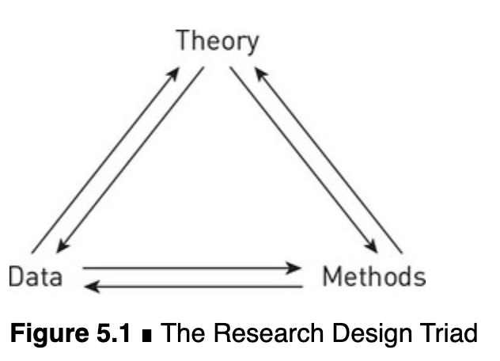

# Framing research

<div class="rmdkey">
<p>In this chapter you will learn:</p>
<ul>
<li>the goals of this textbook</li>
<li>the reasoning for using the R programming language</li>
<li>important text conventions employed in this textbook</li>
</ul>
</div>

Before jumping into the code, every researcher must come to a project with a clear idea about the purpose of the analysis. This means doing your homework in order to understand what it is exactly that you want to achieve; that is, you need to identify a research question. The first step is become versed in the previous literature on the topic. What has been written? What are the main findings? Secondly, it is important to become familiar with the standard methods for approaching the topic of interest. How has the topic been approached methodologically? What are the types, sources, and quality of data employed? What have been the statistical approaches employed? What particular statistical tests have been chosen? Getting an overview not only of the domain-specific findings in the literature but also the methodological choices will help you identify promising plan for carrying out your research.

## ...chapter subsection

text 


```r
# Packages
```


## Annotated readdings

**Ignatow, G., & Mihalcea, R. (2017). An introduction to text mining: Research design, data collection, and analysis. Sage Publications.** 
[@Ignatow2017]

Chapter 5 "Designing your research project"

> Research design is essentially concerned with the basic architecture of research projects, with designing projects as systems that allow theory, data, and research methods to interface in such a way as to maximize a project’s ability to achieve its goals (see Figure 5.1). Research design involves a sequence of decisions that have to be taken in a project’s early stages, when one oversight or poor decision can lead to results that are ultimately trivial or untrustworthy. Thus, it is critically important to think carefully and systematically about research design before committing time and resources to acquiring texts or mastering software packages or programming languages for your text mining project.


**Egbert, J., Larsson, T., & Biber, D. (2020). Doing Linguistics with a Corpus: Methodological Considerations for the Everyday User. Cambridge University Press.** [@Egbert2020]

Chapter 3 "Research Designs: Linguistically Meaningful Research Questions, Observational Units, Variables, and Dispersion"

- Research questions should drive decisions about the choice of observational unit, how variables are defined, and the choice of research design.
- Observational units can be defined at the level of the linguistic feature,
the text, or the corpus.
- Variables can be measured qualitatively, according to variants of a
linguistic feature, or quantitatively, using rates of occurrence for features.

Chapter 7 "Interpreting Quantitative Results"

- Linguistics is done by linguists, not by computers.
- In order to be useful, quantitative corpus linguistic analysis should be
coupled with sound qualitative interpretation.
- Researchers can rely on linguistic context, text-external context, and
linguistic theory to guide their interpretation of quantitative corpus findings.
